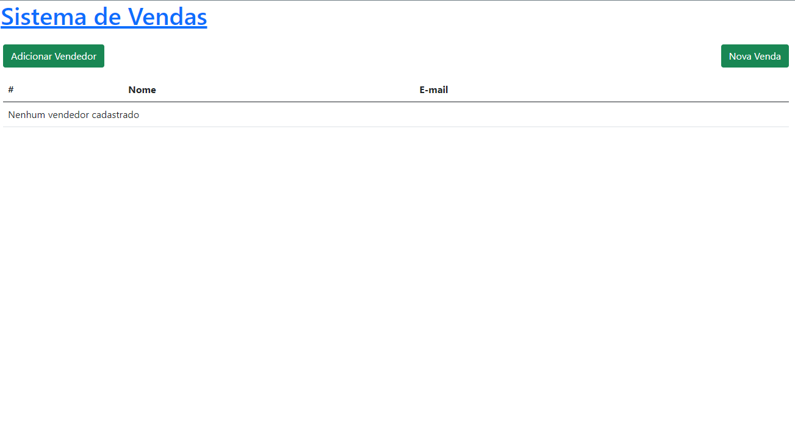
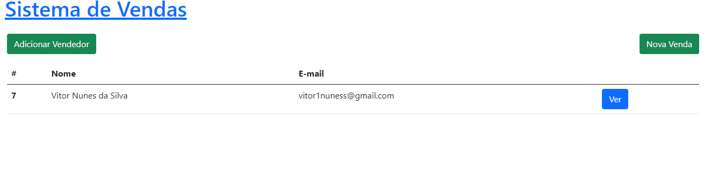
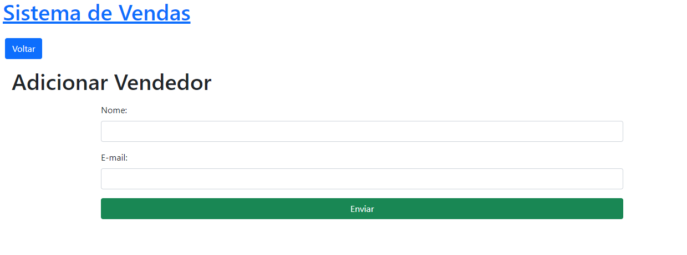
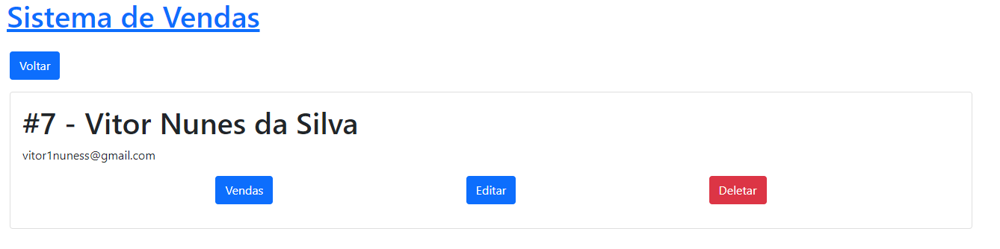
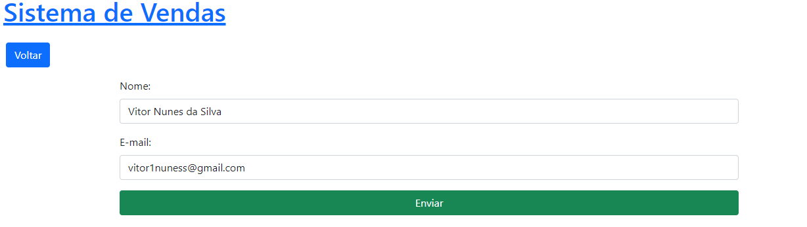
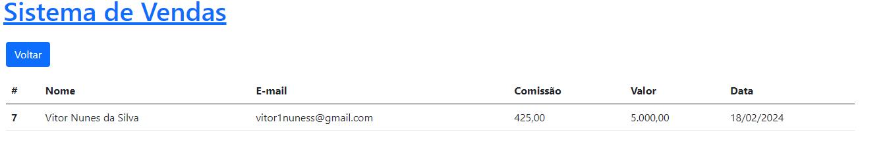
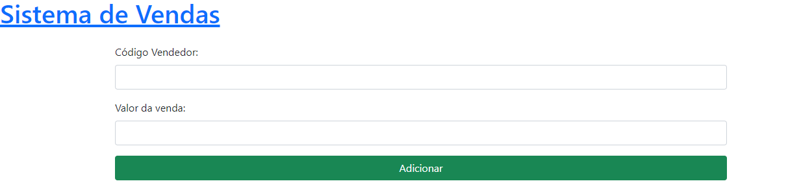

# Desafio Técnico - Programador PHP I

## Aplicação:

Um sistema para cadastro de vendedores e vendas. Cada venda é registrada para seu devido vendedor e ao final calcula sua comissão.

## Funcionalidades:

- CRUD de vendedores
- Inserir nova venda
- Lista todas as vendas de um vendedor
- Ao final de cada dia envia um email com um relatório para cada vendedor com a soma de todas as vendas efetuadas no dia

## Requisitos:

- **Laravel 10+**
- **PHP 8+**
- **Composer**
- **Git**

## Instalação:

1. Clone o repositório Git:
```
git clone https://github.com/VitorNuness/desafio-tray.git
```

2. Instale as depêndencias:
```
composer install
```

3. Copie o arquivo .env.examplo para .env:
```
cp .env.example .env
```

4. Gere a chave da aplicação:
```
artisan key:generate
```

6. Configure o banco de dados no arquivo .env:
* Obs.: Recomendado uso do MySQL como banco, visto que a aplicação foi desenvolvida com o mesmo.
```
DB_CONNECTION=mysql
DB_HOST=127.0.0.1
DB_PORT=3306
DB_DATABASE=<nome_banco_de_dados>
DB_USERNAME=<seu_usuario>
DB_PASSWORD=<sua_senha>
```

7. Execute as migrações:
```
php artisan migrate
```

8. Configure as variáveis de e-mail:
```
MAIL_MAILER=smtp
MAIL_HOST=mailpit
MAIL_PORT=1025
MAIL_USERNAME=<seu_usuario_de_email>
MAIL_PASSWORD=<sua_senha_de_email>
MAIL_ENCRYPTION=null
MAIL_FROM_ADDRESS="hello@example.com"
MAIL_FROM_NAME="${APP_NAME}"
```

9. Inicie as rotinas, para envio de e-mail ao final do dia, localmente:
```
php artisan schedule:work
```

- Ou consulte a [documentação do Laravel sobre tarefas](https://laravel.com/docs/10.x/scheduling#running-the-scheduler).

## Uso:

### Views:

1. **Tela principal**:

    Assim que o sistema é acessado, mostra uma lista com todos os vendedores.

- **Botão "Adicionar Vendedor"**: Navega para o formulário de cadastro de vendedor.

- **Botão "Nova Venda"**: Navega para o formulário para registrar uma venda.

    

    

2. **Formulário para cadastrar vendedor**:

    

3. **Informações do vendedor**:

    

4. **Editar vendedor**:

    

5. **Lista de vendas**:

    

6. **Formulário para registrar venda**:

    

### API:

A API fornece os seguintes endpoints:

- `GET /api/sellers`: Retorna todos os vendedores.
- `POST /api/sellers`: Cria um novo vendedor.
- `GET /api/sellers/{id}`: Retorna um vendedor específico.
- `PUT /api/sellers/{id}`: Atualiza um vendedor específico.
- `DELETE /api/sellers/{id}`: Deleta um vendedor específico.
- `GET /api/sellers/{id}/sales`: Retorna todas as vendas do vendedor.
- `POST /api/sales`: Cria uma nova venda.


## Licença

Esta aplicação é licenciada sob a licença MIT. Veja o arquivo [LICENSE](LICENSE) para mais detalhes.